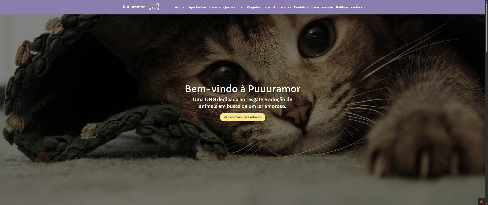
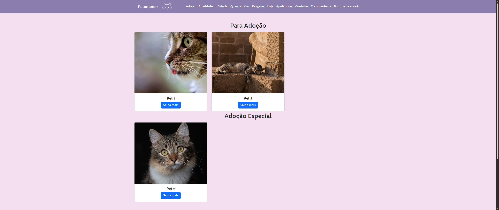
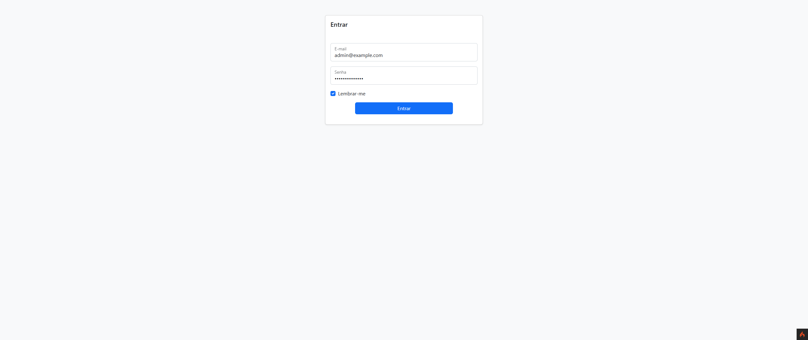
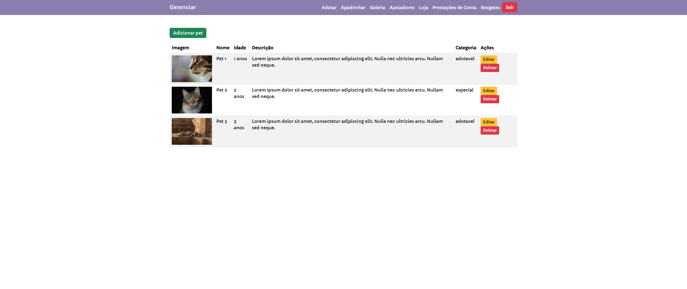
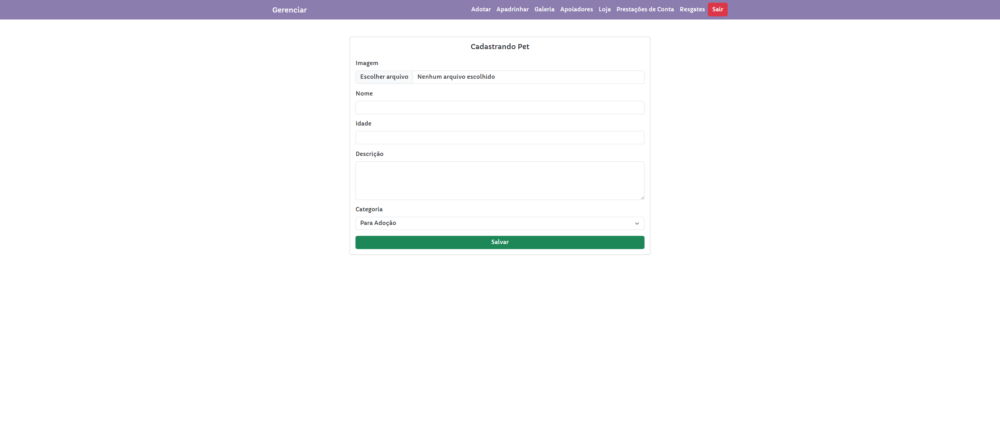
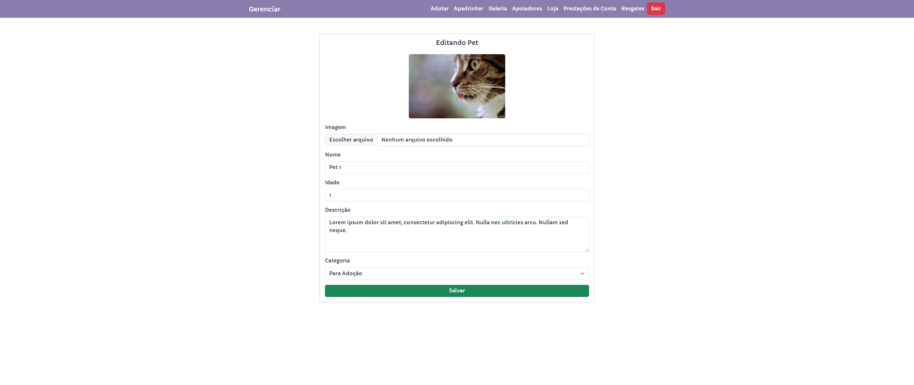

## Puuur Amor
Puuur Amor is a web application built as a showcase for the NGO **Puuur Amor**, an independent initiative based in Charqueadas/RS focused on rescuing, fostering, and promoting responsible adoption of abandoned cats.

## Technology

Here are the technologies used in this project.

* PHP
* CodeIgniter 4
* CodeIgniter Shield (Authentication)
* HTML
* CSS
* JavaScript
* Bootstrap

## Services Used

* IFSul (Extensão) - Local Server Deploy

## Packages / Libraries

* codeigniter4/framework
* codeigniter4/shield
* Bootstrap

## Getting started

* Dependency
  - PHP (7.4+)
  - Composer
  - Web Server (Apache/Nginx) - Wamp or Xamp
  - MySQL

* To install dependencies:
~~~bash
composer install
~~~

* Database setup (MySQL)
  - Create a database: `sistema_prod`
  - Configure the `.env` file with your database credentials (see the `.env` section below)

* Migrations / Seed (essential)
~~~bash
php spark migrate --all
php spark db:seed AdminUserSeeder
~~~

* To run the project (essential)
~~~bash
php spark serve
~~~

Access: `http://localhost:8080`

### Optional: `.env` configuration
Update these values in the `.env` file:

- `database.default.hostname = localhost`
- `database.default.database = sistema_prod`
- `database.default.username = root`
- `database.default.password = <your_password>`
- `database.default.DBDriver = MySQLi`

### Optional: Admin credentials
Edit the default admin user credentials in:
`/app/Database/Seeds/AdminUserSeeder.php`

- `$username`
- `$email`
- `$password`

### Routes
- `/`: Home

- `/resource`: Resources

- `/login`: Admin Dashboard Login

- `/resource/listar`: All Resource Entries and Delete Button

- `/resource/criar`: Creating a Resource Entry

- `/resource/editar`: Updating a Resource Entry

## Links
  - Live: https://puuuramor.com.br/
  - Repository: https://github.com/joaooneta/back-puuuramor

## Versioning
  1.0.0

## Authors
  * **João Oneta**
  * **Students from the Atividade de Extensão II class (IFSul — TSI)**

Please follow github and join us! Thanks to visiting me and good coding!
